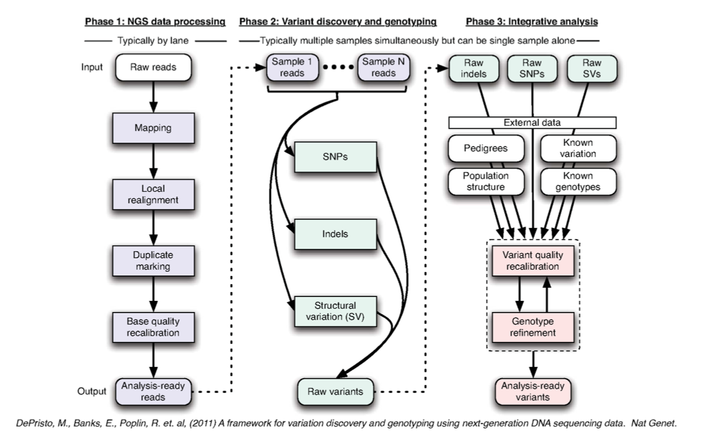
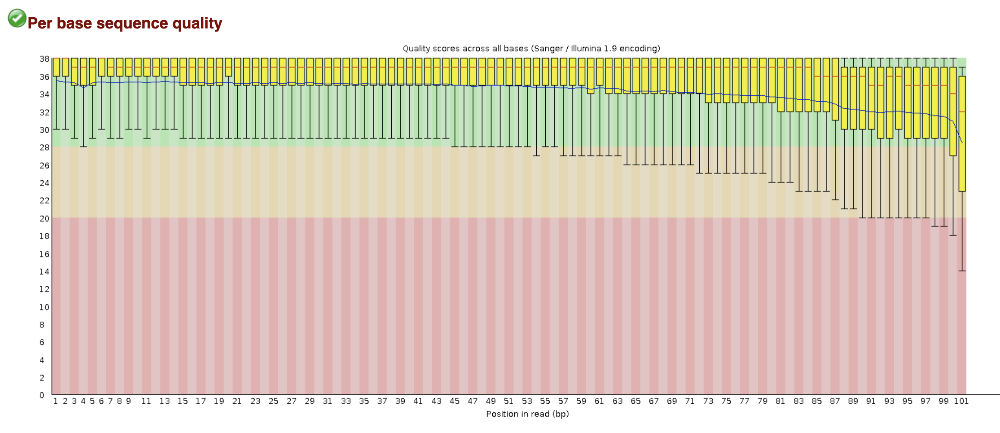
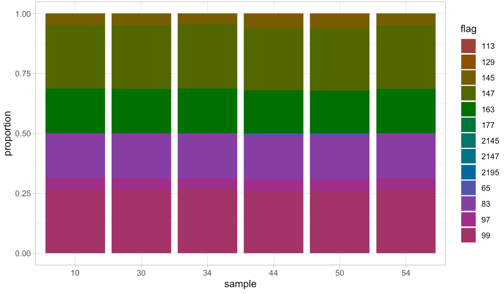

# Our Approach to Analyzing Sequencing Data of Two Simulated Unicorn Populations

## Megan Dolan

** Please note that there is information paraphrased and repeated from the lecture material given by Dr. Omar Cornejo in Methods of Population Genetics: BIOL 534, Spring 2020 **

### Information about our data:

The samples were simulated using the first chromosome of human genomic seqencing data. We are looking at 60 samples gathered from two populations of "unicorns". The populations are labeled either "M" for "Mountain" or "S" for "Savannah". Of the 60 samples available, I have chosen to analyze the following samples:

+ s10
+ s30
+ s34
+ s44
+ s50
+ s54

The class as a whole will be responsible for completing the analysis of the other 54 samples. One of the main objectives for the class is to determine if there are truly two separate populations and if so, when the populations diverged from one another.

We need to follow a set process in order to create assembled genomes, ensure quality of our data, observe genetic variation within individuals, and determine population structure to answer biological questions. The overview of processing our NGS data is shown in the figure below:




## Phase 1: NGS Data Processing

This section includes:

* Quality score assessment (FastQC)
* Trimming
* Local realignment or mapping using BWA
* SAM to BAM file conversion


### 1) Quality Score Assessment with FastQC

This step is to assess the quality of the NGS data that we initially input. Since we are usually looking at genomic data on a large scale, we are unable to observe everything in detail. Therefore, we need some way to determine quality on a large scale. 

**Note: quality control should not be used as an automated filter**

The quality control is dependent on the dataset you are looking at - it can change based on sequencing data, instrumentation, and replication event (time). 

We can determine the quality of our data by using a numerical value to assess the data, otherwise known as a Phred score.

```
module load fastqc
outputFile="/data/cas/bio534/megandolan/unicorn/fastqc_files"
pw_data="/data/cas/bio534/raw_unicorn"

for i in `cat mylist`; do
        fastqc --nogroup -o $outputFile $pw_data/s$i.read1.fq.gz $pw_data/s$i.read2.fq.gz
done
```

**Note: "mylist" is a text file containing the names of raw read data for individual samples**

FastQC generates a user-friendly html-based GUI that can be used to view the quality of the raw sequencing data. When looking at a representative sample, we find an output that looks like the following:



In the image above, the region indicated in green generally represents high quality scores. We see that the average quality of the reads (indicated by red lines in the box plots) in our representative example falls in the "high quality score" region. However, towards the end of the reads (bp 99-101), we see that the quality score decreases. This is a result of the lower stochastic likelihood of sequencing longer reads due to the nature of Illumina sequencing technology (polymerase terminates at tagged nucleotides). 

This step is important in considering how to trim our reads (or if trimming is even needed). If the quality of a read starts to drop off after certain points, you need to decide whether or not that is worth keeping. Otherwise, you can cut off of the bad quality regions of the sequence. For example, if you end up with some reads that are 50% the size of the average reads, you might not want to keep those. Furthermore, base quality assessment isn't considered during the process of mapping, which is why it is necessary to look at the quality before mapping.

In our case, we decided to trim reads that have a quality score equivalent to or greater than 28. Although we will lose some reads that fall below this threshold, most of our data lies above this cutoff, with the ends (around 99-101 bp) being the major issues. 


### 2) Trimming

Hard vs. Conditional Trimming:

With hard trimming, you first determine the region of the raw reads you want to keep and then you trim based on that cutoff. However, with conditional trimming, you first determine a threshold (usually based off of the quality score assessment) and then you trim the reads that do not meet the cutoff. This prevents unnecessary trimming of sequences that may match a certain criteria that is deemed optimum. 

For our sequences, we used a conditional trimming approach, where we determined a quality score cutoff of 28. This can be seen in the following script, noted by the ```--quality ``` flag:

```
module load fastqc
module load cutadapt
pw_data="/data/cas/bio534/raw_unicorn"
outputFile="/data/cas/bio534/megandolan/unicorn/trimmed_files"
bio534_trim_galore="/data/cas/bio534/programs/TrimGalore/trim_galore"

for i in $(cat mylist);
do
        $bio534_trim_galore --output_dir $outputFile/reports \
                --quality 28 \
                --illumina \
                --phred33 \
                --fastqc_args "--nogroup --noextract --outdir $outputFile" \
                --stringency 6 \
                --length 60 \
                --paired \
                $pw_data/s$i.read1.fq.gz \
                $pw_data/s$i.read2.fq.gz
done
```

Reads can also be trimmed to improve the quality of alignment to a reference genome. Due to errors during the sequencing process, areas with low quality scores can affect the alignment of reads to the reference genome. This is an issue when identifying reads in order to compose a whole genome for the sample you are sequencing.

Some errors that can affect the quality score include:

+ PCR issues
  + If you have low coverage, early sequencing errors become amplified and lead to bigger problems
+ Contamination
+ Illumina sequencing errors
  + Nucleotide imaging (usually reduced due to consensus signaling)
  + Sample sequencing


### 3) Mapping with BWA

In order to determine the identity and location of short sequence reads in the genome, you need a computationally efficient method to perform accurate alignments of millions of reads. There are several factors that need to be considered in the mapping process. These include, but are not limited to:

+ Alignment scoring
+ Read source
+ Sequencing format (PE or SE)
+ Length of reads
+ Error rates
+ Heterozygosity

While long reads help with structural variance and identification of different isoforms, short reads can be great for resequencing purposes. Short reads can lead to detection of SNP variance (presence/absence). However, most of the reads generated from illumina sequencing are short. To determine the location/identity of large quantities of short reads, first, see if there is a close enough reference to your organism to use as a genome reference for assembly. Most applications align the reads to a reference genome that is similar to the samples being studied. Short read mapping usually requires the following:

+ Input:
  + A reference genome
  + A collection of many 50-300bp tags (reads)
  + User-specified parameters

This data can generate the following:

+ Output:
  + One or more genomic coordinates for each tag 

If you have more than 90% of the bases from the raw reads with quality scores of 30 or more, then >80% of the reads should map to the reference genome. However, due to non-unique sequences (repeats, segmental duplications) and multiple mapping events (a single tag may occur more than once in the reference genome), not all of the reads will map sucessfully to the reference. 

A few additional phenomenons that could lead to reduced mapping include:

+ Highly divergent reads
+ Structural variance
+ Contamination
+ Repetitive regions
+ Short reads

While this discrepancy can cause issues in mapping, some mismatches may represent SNPs. We can specify a "phred-style quality score threshold" to determine the maximum number of allowed mismatches. However, as the number of allowed mismatches increases, so does the number of mapped tags and the number of incorrectly mapped tags.

Even if you have high mappability of your reads, that does not necessarily mean that there are not issues with your samples. For example, if you have an organism with two chromosomes,  90% of the mapped reads may  come from one of the chromosomes. This most likely means that there was an error in the library preparation.

There are several common algorithms that can be used to map short reads to a reference genome. However, each of these algorithms come with caveats.

1. A hash table is fast, but requires nearly perfect matches. This becomes a challenge for datasets with significant variance or the case where you don't have that close of a reference genome.
2. Array scanning is also fast, but can only handle a limited number of mismatches.
3. Dynamic programming is accurate, but is computationally costly.
4. Burrows-Wheeler Transform (the algorithm that BWA utilizes) balances speed and performance, making it the best option to use on our dataset.

However, when mapping short reads to a reference genome, there are several considerations that need to be made:

+ Alignment scoring method
+ Speed
+ Quality
+ Seeding
  + Reads and references are cut into small seeds, seed pairs are stored in an index, spaced seeds are looked up in the index, then "hits" are confirmed and reported to the user.
+ Gapped alignment

We chose to use the BWA (Burrows-Wheeler Aligner) software, which uses the Burrows-Wheeler Transform algorithm to map the reads to the reference genome. This algorithm uses less memory, indexes the reference genome for quick and efficient seeding, and has the potential to report non-unique alignments that can be specified by the user. In addition, there were two options to run BWA. We could have used the ```bwa mem``` function, which calls mapping of pairs together, or ```bwa```, which aligns pairs individually, then compares. We decided to use ```bwa mem```, as it is more accurate when there are higher error rates. For further information, the software can be found here: [BWA software](http://bio-bwa.sourceforge.net/).

In order to run ```bwa mem``` on our samples, we first need to create the index, which has our reference genome. The index is noted as the ```.fa``` file format. After creating the BWA index, the following script was used to map the reads from each sample to the reference genome: 

```
module load bwa/0.7.17

samp_path="/data/cas/bio534/megandolan/unicorn/trimmed_files/reports"

for i in $(cat mylist);
do
        bwa mem -R '@RG\tSM:S'$i'\tID:S'$i'\tPL:ILLUMINA\tDT:2020-2-3' /data/cas/bio534/reference/unicorn.fa $samp_path/s$i.read1_val_1.fq.gz $samp_path/s$i.read2_val_2.fq.gz > align/s$i.align.sam
done
```

The ```-R``` flag in the ```bwa mem``` script creates a unique identifier at the top of the output files for each sample. Each of the sections of the identifier requires different information of the sample, as shown below:

+ RG: read group
+ SM: sample info*
+ ID: individual ID*
+ PL: Sequencing platform used
+ PU: What platform unit was used (not shown in the script)
+ DT: Sequencing date (for the purposes of this class, I used the date that I ran the script)

**If you run a sequence multiple times, then you will have multiple individual IDs, but they all go to the same sample ID.*

The mappability of our reads can be visualized by using the UCSC mapability score GUI. 


### 4) SAM to BAM Format 

The BAM format is a compressed version of the SAM (Sequence Alignment/Mapping) format, which we get as an output of the BWA mapping. BAM files provide us with all of the information needed and are much easier to extract relevant information from, which is why we are convering the files from SAM format to BAM format. To do so, we ran the following script:

```
module load java/oracle_1.8.0_92
module load bamtools/2.4.1
module load picard/2.21.4
module load samtools/1.9
module load gcc/7.3.0

ref="/data/cas/bio534/reference/unicorn.fa"
OUTPUT=/data/cas/bio534/reference/unicorn.dict

for i in $(cat mylist);
do
### Convert SAM file to BAM file
        samtools view -ubhSt \
        $ref.fai \
        align/s$i.align.sam \
        -o s$i.bam

### Clean SAM file: Cleans the provided SAM/BAM, soft-clipping beyond-end-of-reference alignments and setting MAPQ to 0 for unmapped reads.
# Remember: need to load java 1.8 for the newest version of Picard Tools to work
# Note: I'm only going to copy the module line for picard once to save space. --> Not really sure what this means

        picard CleanSam \
        INPUT=s$i.bam \
        OUTPUT=s$i.clean.bam \
        VALIDATION_STRINGENCY=SILENT


### Sort SAM file: Sorts a SAM OR BAM file. In this case we will do it by name prior to the next step
        picard SortSam \
        INPUT=s$i.clean.bam \
        OUTPUT=s$i.clean.nsorted.bam \
        SORT_ORDER=queryname \
        VALIDATION_STRINGENCY=LENIENT


### Fix mate information: Verify mate-pair information between mates and fix if needed.
        picard FixMateInformation \
        INPUT=s$i.clean.nsorted.bam \
        OUTPUT=s$i.clean.fix.bam \
        VALIDATION_STRINGENCY=SILENT
        
### Sort SAM file: Sorts a SAM or BAM file.
        picard SortSam \
        INPUT=s$i.clean.fix.bam \
        OUTPUT=s$i.clean.fix.sorted.bam \
        SORT_ORDER=coordinate \
        VALIDATION_STRINGENCY=LENIENT

### Mark Duplicates: This tool locates and tags duplicate reads in a BAM or SAM file.
# Remember to sort the file by NAME rather than coordinate in order to use this tool.
        picard MarkDuplicates \
        INPUT=s$i.clean.fix.sorted.bam \
        OUTPUT=s$i.F.bam \
        REMOVE_DUPLICATES=TRUE \
        METRICS_FILE=myaccession.DUP_METRICS.OUT \
        VALIDATION_STRINGENCY=SILENT

### Validate SAM: This tool reports on the validity of a SAM or BAM.
        picard ValidateSamFile \
        INPUT=s$i.F.bam \
        OUTPUT=s$i.validation \
        VALIDATION_STRINGENCY=LENIENT

### Collect Stats
# index the BAM file for idxstats and stats tools below
        samtools index s$i.clean.fix.sorted.bam

# reads per chrom/contig
        samtools idxstats s$i.F.bam > s$i.IDXSTATS
# general stats
        bamtools stats -in s$i.F.bam > s$i.STATS


# Collection of detail metrics
        picard CollectAlignmentSummaryMetrics \
        REFERENCE_SEQUENCE=$ref \
        INPUT=s$i.F.bam \
        OUTPUT=s$i.metrics \
        VALIDATION_STRINGENCY=LENIENT
done

###########
# Clean the folder and eliminate all the intermediate files once double - checked

rm my_sample.sam my_sample.clean.bam my_sample.clean.nsorted.bam my_sample.clean.fix.bam my_sample.clean.fix.sorted.bam
```

Contained within the BAM files, information on alignment of the raw reads to the reference is kept as bit scores. These scores are numerical values based on boolean statements that use a binomial numbering system. The bit scores, otherwise denoted as bitwise flags, keep track of read alignments, such as forward or reverse, as well as structural variance. While the bit scores are not user-friendly, you can look up the unique meaning of each score by visiting: [Picard - Explain Flags Tool](https://broadinstitute.github.io/picard/explain-flags.html).

**Note that the bitwise flag format gives several pieces of key information regarding the reads, despite it being only one number**.

From the converted BAM files, we can then look at the bitwise flags to determine the nature of our alignments. We used the following script to extract the bitwise flags from each sample and the number of associated reads per flag:

```
module load samtools/1.9

for i in $(cat mylist);
do
        samtools view BAM/Final/s$i.F.bam |awk '{print $2}' |sort |uniq -c |sort -r
done
```


The output of our script gave us the following flag breakdown based on number of associated reads per sample:

| Bitwise Flag | Sample 10 | Sample 30 | Sample 34 | Sample 44 | Sample 50 | Sample 54 |
| ------------ | --------- | --------- | --------- | --------- | --------- | --------- |
| 99           | 7692464   | 7692218   | 7692290   | 7692307   | 7692129   | 7692161   |
| 147          | 7692464   | 7692218   | 7692290   | 7692307   | 7692129   | 7692161   |
| 83           | 64570     | 64507     | 64724     | 64450     | 64540     | 64725     |
| 163          | 64570     | 64507     | 64724     | 64450     | 64540     | 64725     |
| 97           | 16        | 20        | 15        | 23        | 24        | 20        |
| 145          | 16        | 20        | 15        | 23        | 24        | 20        |
| 2195         | -         | 1         | -         | -         | -         | -         |
| 2145         | -         | 1         | -         | -         | -         | -         |
| 65           | -         | -         | 1         | 2         | 2         | -         |
| 2147         | -         | -         | 1         | -         | -         | -         |
| 129          | -         | -         | 1         | 2         | 2         | -         |
| 177          | -         | -         | -         | 1         | 1         | -         |
| 113          | -         | -         | -         | 1         | 1         | -         |


As a visualization, the following figure displays the same information in a logarithmic scale:



​							**Note that any value equal to 1 cannot be visualized on a logarithmic scale**


Keeping in mind that the data is simulated, we see that the distribution of the bitwise flags is fairly uniform. 

A breakdown of the bitwise flags declared in the sample set are indicated according to the following table:

| Bitwise Flag | Meaning                                                      |
| ------------ | :----------------------------------------------------------- |
| 99           | read paired (0x1), read mapped in proper pair (0x2), mate reverse strand (0x20), first in pair (0x40) |
| 147          | read paired (0x1), read mapped in proper pair (0x2), read reverse strand (0x10), second in pair (0x80) |
| 83           | read paired (0x1), read mapped in proper pair (0x2), read reverse strand (0x10), first in pair (0x40) |
| 163          | read paired (0x1), read mapped in proper pair (0x2), mate reverse strand (0x20), second in pair (0x80) |
| 97           | read paired (0x1), mate reverse strand (0x20), first in pair (0x40) |
| 145          | read paired (0x1), read reverse strand (0x10), second in pair (0x80) |
| 2195         | read paired (0x1), read mapped in proper pair (0x2), read reverse strand (0x10), second in pair (0x80), supplementary alignment (0x800) |
| 2145         | read paired (0x1), mate reverse strand (0x20), first in pair (0x40), supplementary alignment (0x800) |
| 65           | read paired (0x1), first in pair (0x40)                      |
| 2147         | read paired (0x1), read mapped in proper pair (0x2), mate reverse strand (0x20), first in pair (0x40),  supplementary alignment (0x800) |
| 129          | read paired (0x1), second in pair (0x80)                     |
| 177          | read paired (0x1), read reverse strand (0x10), mate reverse strand (0x20), second in pair (0x80) |
| 113          | read paired (0x1), read reverse strand (0x10), mate reverse strand (0x20), first in pair (0x40) |

Based on the above bitwise flags, we can see that all of our reads map to a proper pair. Furthermore, we see that the majority of our reads are forward facing, with some reverse reads present. 


## Phase 2: Variant Discovery and Genotyping

Genetic variation is the driving force in evolution, as it allows natural selection to increase or decrease allele frequencies within a population. Genetic variation enables some individuals to become more or less fit in a population, leading to selection on a population. It is essential to quantify and characterize this variation within and between populations in order to answer biological questions regarding the organisms of interest. There are several types of variation:

+ Single nucleotide aberrations (SNPs vs SNVs)
+ *Short insertions or deletions (indels)
+ Larger structural variation

**Note that there are no indels in our simulated dataset*

The framework for variation discovery and genotyping of NGS data is the GATK (Genome Analysis Toolkit) package, which we will use for most of this section. GATK is a package for aligned NGS data analysis, which includes a SNP and genotype caller (Unifed Genotyper), SNP filtering (Variant Filtration) and SNP quality recalibration (Variant Recalibrator). The syntax for this software can be found here: [GATK](https://gatk.broadinstitute.org/hc/en-us).


### 1) GATK Call Unified Genotyper

In order to call SNPs, we must first confidently identify all sites that do not match the reference. From this information, we can create genotypes for each base where not all of our data aligns with the reference genome. 

To identify these sites, we must take our call-ready BAM files that were previously compressed, cleaned, and prepared, then input those files into the GATK unified genotyper. The unified genotyper looks at individual variable sites and uses a Bayesian framework to assign probabilities to genotypes.

The GATK unified genotyper filters artifacts out of the SNP calls through three pass approaches:

1. It first emits all sites that potentially contain a true variant
2. It then aggregates SNP covariants in the raw VCF to determine the relationship between each covariate and the error (this step requires experience/expertise) 
3. Finally, it applies these filters to the raw VCF using the GATK VariantFiltration tool (mentioned above).


To avoid overcomplicating the process, we are working with the automated default settings for variant filtering within the GATK package. See the following script for running the GATK unified genotyper on the unicorn dataset:

```
#!/bin/bash
#SBATCH --job-name=ug.megan.call
#SBATCH --output=/data/cas/bio534/megandolan/script_log/unifiedgenotyper.out 
#SBATCH --error=/data/cas/bio534/megandolan/script_log/unifiedgenotyper.err
#SBATCH --workdir=/data/cas/bio534/megandolan/unicorn/UnifiedGenotyper
#SBATCH --nodes=1
#SBATCH --mem=64G
#SBATCH --time=70:00:00

module load gatk/4.1.4.1
module load samtools/1.9
module load vcftools/0.1.16

################ Call SNPs and Indels for Pop 1################
gatk --analysis_type UnifiedGenotyper \
-ploidy 2 \
--reference_sequence /data/cas/bio534/reference/unicorn.fa \
--output_mode EMIT_ALL_SITES \
--input_file /data/cas/bio534/final_bams/s0.F.bam \
--input_file /data/cas/bio534/final_bams/s1.F.bam \
--input_file /data/cas/bio534/final_bams/s2.F.bam \
--input_file /data/cas/bio534/final_bams/s3.F.bam \
--input_file /data/cas/bio534/final_bams/s4.F.bam \
--input_file /data/cas/bio534/final_bams/s5.F.bam \
--input_file /data/cas/bio534/final_bams/s6.F.bam \
--input_file /data/cas/bio534/final_bams/s7.F.bam \
--input_file /data/cas/bio534/final_bams/s8.F.bam \
--input_file /data/cas/bio534/final_bams/s9.F.bam \
--input_file /data/cas/bio534/final_bams/s10.F.bam \
--input_file /data/cas/bio534/final_bams/s11.F.bam \
--input_file /data/cas/bio534/final_bams/s12.F.bam \
--input_file /data/cas/bio534/final_bams/s13.F.bam \
--input_file /data/cas/bio534/final_bams/s14.F.bam \
--input_file /data/cas/bio534/final_bams/s15.F.bam \
--input_file /data/cas/bio534/final_bams/s16.F.bam \
--input_file /data/cas/bio534/final_bams/s17.F.bam \
--input_file /data/cas/bio534/final_bams/s18.F.bam \
--input_file /data/cas/bio534/final_bams/s19.F.bam \
--input_file /data/cas/bio534/final_bams/s20.F.bam \
--input_file /data/cas/bio534/final_bams/s21.F.bam \
--input_file /data/cas/bio534/final_bams/s22.F.bam \
--input_file /data/cas/bio534/final_bams/s23.F.bam \
--input_file /data/cas/bio534/final_bams/s24.F.bam \
--input_file /data/cas/bio534/final_bams/s25.F.bam \
--input_file /data/cas/bio534/final_bams/s26.F.bam \
--input_file /data/cas/bio534/final_bams/s27.F.bam \
--input_file /data/cas/bio534/final_bams/s28.F.bam \
--input_file /data/cas/bio534/final_bams/s29.F.bam \
--heterozygosity 0.001 \
--confidence 50 \
--out pop1.vcf.gz

################ Extract all SNPs for Pop 1 from call set ################
gatk --analysis_type SelectVariants \
--reference_sequence /data/cas/bio534/reference/unicorn.fa \
--variant pop1.vcf.gz \
--selectTypeToInclude SNP \
--out pop1.raw.snps.vcf.gz

################ Apply filter to SNP call set for Pop1 ################
gatk --analysis_type VariantFiltration \
--reference_sequence /data/cas/bio534/reference/unicorn.fa \
--variant pop1.vcf.gz \
--filterExpression "QD < 2.0 || FS > 60.0 || MQ < 40.0 || MQRankSum < -12.5" \
--filterName "FAILED_MISERIBLY" \
--out pop1.filtered.vcf.gz

################ Call SNPs and Indels for Pop 2 ################
gatk --analysis_type UnifiedGenotyper \
-ploidy 2 \
--reference_sequence /data/cas/bio534/reference/unicorn.fa \
--output_mode EMIT_ALL_SITES \
--input_file /data/cas/bio534/final_bams/s30.F.bam \
--input_file /data/cas/bio534/final_bams/s31.F.bam \
--input_file /data/cas/bio534/final_bams/s32.F.bam \
--input_file /data/cas/bio534/final_bams/s33.F.bam \
--input_file /data/cas/bio534/final_bams/s34.F.bam \
--input_file /data/cas/bio534/final_bams/s35.F.bam \
--input_file /data/cas/bio534/final_bams/s36.F.bam \
--input_file /data/cas/bio534/final_bams/s37.F.bam \
--input_file /data/cas/bio534/final_bams/s38.F.bam \
--input_file /data/cas/bio534/final_bams/s39.F.bam \
--input_file /data/cas/bio534/final_bams/s40.F.bam \
--input_file /data/cas/bio534/final_bams/s41.F.bam \
--input_file /data/cas/bio534/final_bams/s42.F.bam \
--input_file /data/cas/bio534/final_bams/s43.F.bam \
--input_file /data/cas/bio534/final_bams/s44.F.bam \
--input_file /data/cas/bio534/final_bams/s45.F.bam \
--input_file /data/cas/bio534/final_bams/s46.F.bam \
--input_file /data/cas/bio534/final_bams/s47.F.bam \
--input_file /data/cas/bio534/final_bams/s48.F.bam \
--input_file /data/cas/bio534/final_bams/s49.F.bam \
--input_file /data/cas/bio534/final_bams/s50.F.bam \
--input_file /data/cas/bio534/final_bams/s51.F.bam \
--input_file /data/cas/bio534/final_bams/s52.F.bam \
--input_file /data/cas/bio534/final_bams/s53.F.bam \
--input_file /data/cas/bio534/final_bams/s54.F.bam \
--input_file /data/cas/bio534/final_bams/s55.F.bam \
--input_file /data/cas/bio534/final_bams/s56.F.bam \
--input_file /data/cas/bio534/final_bams/s57.F.bam \
--input_file /data/cas/bio534/final_bams/s58.F.bam \
--input_file /data/cas/bio534/final_bams/s59.F.bam \
--heterozygosity 0.001 \
--confidence 50 \
--out pop2.vcf.gz

################ Extract all SNPs for Pop 2 from call set ################
gatk --analysis_type SelectVariants \
--reference_sequence /data/cas/bio534/reference/unicorn.fa \
--variant pop2.vcf.gz \
--selectTypeToInclude SNP \
--out pop2.raw.snps.vcf.gz

################ Apply filter to SNP call set for Pop2 ################
gatk --analysis_type VariantFiltration \
--reference_sequence /data/cas/bio534/reference/unicorn.fa \
--variant pop2.vcf.gz \
--filterExpression "QD < 2.0 || FS > 60.0 || MQ < 40.0 || MQRankSum < -12.5" \
--filterName "FAILED_MISERIBLY" \
--out pop2.filtered.vcf.gz

##################### Merging populations vcfs ###################
vcf-merge pop1.vcf.gz pop2.vcf.gz > unicorns.vcf
```

One thing that was not emphasized earlier is the separation of the two inputs based on population. We chose to do this because the unified genotyper may not accurately call SNPs if we were to merge the population data and call SNPs as if we are looking at one whole randomly mating population. Due to this issue, we decided to separate the samples by population and run the unified genotype caller on each subset of data, then merge the two population output files.

The script will generate a final file in Variant Call Format (VCF). The Variant Call Format (VCF) is a TAB-delimited format with each data line consists of the following fields:

| COL  | FIELD  | DESCRIPTION                                                  |
| ---- | ------ | ------------------------------------------------------------ |
| 1    | CHROM  | Chromosome name                                              |
| 2    | POS    | left-most position of the variant                            |
| 3    | ID     | unique variant identifier                                    |
| 4    | REF    | reference allele                                             |
| 5    | ALT    | alternate allele(s), separated by comma                      |
| 6    | QUAL   | variant/reference quality                                    |
| 7    | FILTER | filters applied                                              |
| 8    | INFO   | information related to the variant, separated by semi-colon  |
| 9    | FORMAT | format of the genotype fields, separated by colon (optional) |
| 10+  | SAMPLE | sample genotypes and per-sample information (optional)       |

The VCF output of the GATK unified genotyper script will provide us with the variant call information. However, we will still need to filter the variants. Within the same script, we extracted the SNPs and applied a generic filter to the data. After doing this for both populations, we then merged the files containing the population variants.

#### Notes to consider:

The differences between the haplotype caller and the unified genotyper are described below:

***Haplotype caller***: Call germline SNPs and indels simultaneously via local de novo assembly of haplotypes in an active region.

+ 

***Unified genotypes***: Looks at individual variable sites and uses a Bayesian framework to assign probabilities to genotypes.  

+ 


## Phase 3: Integrative Analysis

